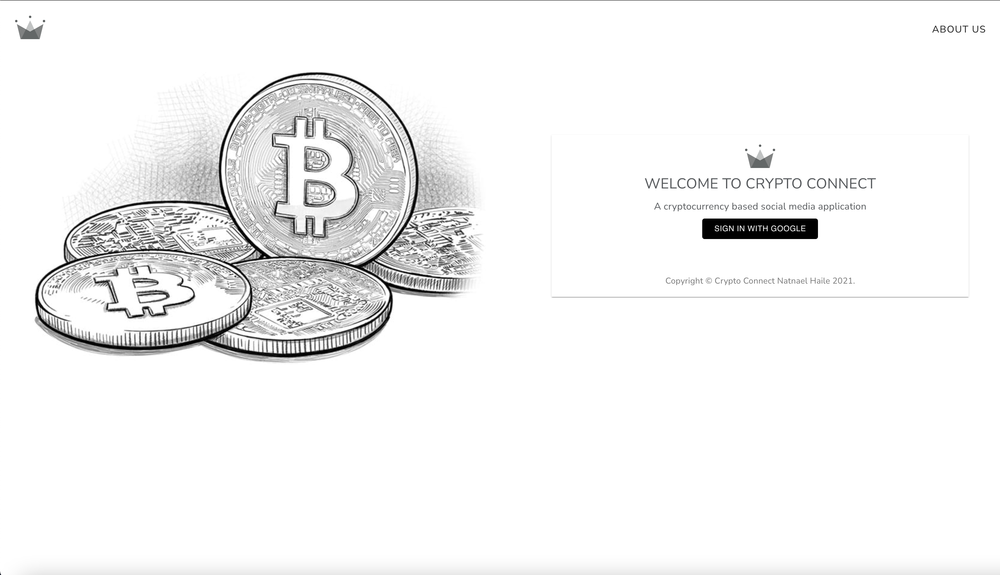
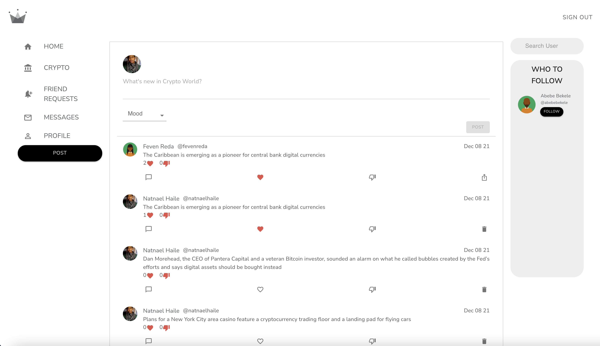
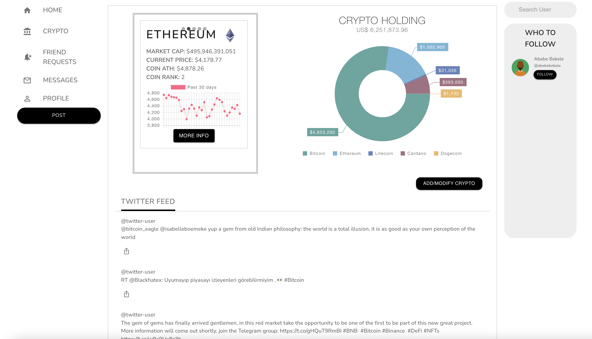
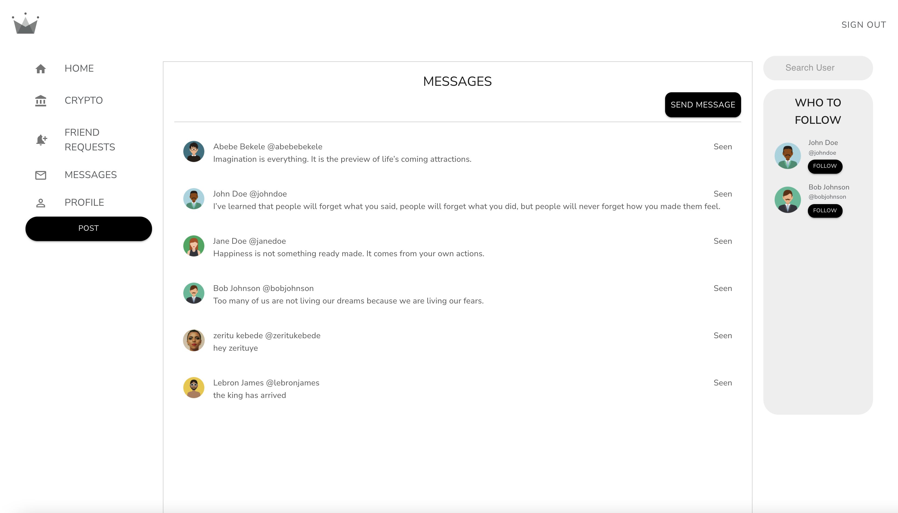
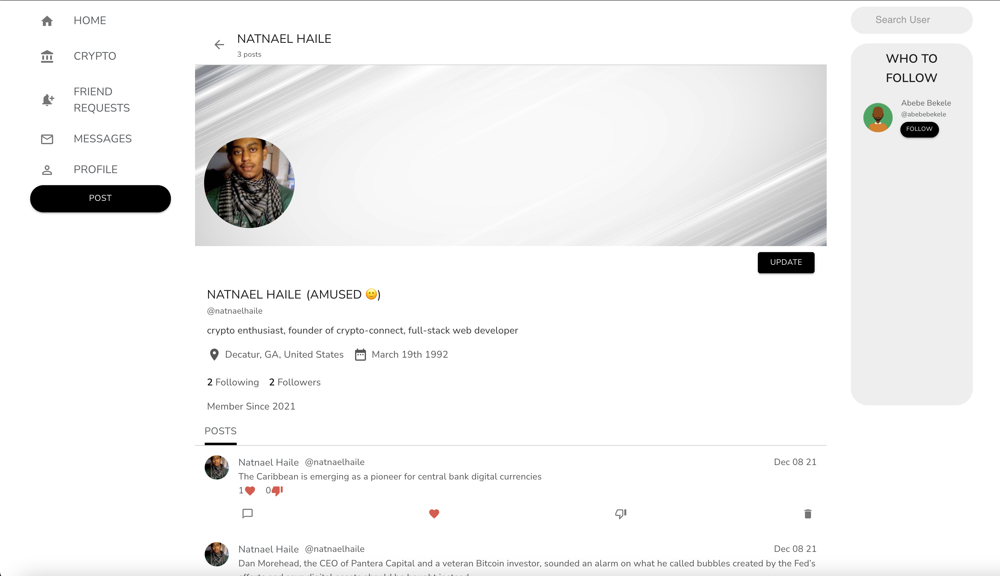

## Crypto Connect
### 
### 
## Live Link
https://crypto-connect-app.herokuapp.com/signin
## Crypto Connect API Repo
https://github.com/natnaelh14/social-media-api
## Description
A full-stack social media application based on cryptocurrency.
* Built with Material-UI, React, Redux, JavaScript, TypeScript, Firebase, GraphQL, MySQL, Sequelize, Docker, Jest, Chai
* User Authentication using Google Firebase (Google, Github, Twitter)
* Features include personalized user profile, posts, comments, likes, dislikes, messaging, following other users,
* Share Posts, and Tweets
* Integrated loading animation and error handling for all the components
* Create a cryptocurrency portfolio and share it with friends
* Get real-time crypto pricing, tweets about crypto holdings and other info
* Ability to use dockerized images for local development
## Table of Contents
* [Installation](#Installation)
* [Docker](#Docker)
* [Usage](#Usage)
* [License](#License)
* [Contributing](#Contribution)
* [Tests](#Tests)
* [Questions](#Questions)
* [Contact](#Contact)
## Installation

To run necessary dependencies, run the following command:

      npm i
      
## Docker

To run docker for local development:

* change the host to 'mysql_server' in connection.js

      docker-compose build

      docker-compose up
      
## Usage

## License
Copyright (C) 2021 Natnael Haile

* Permission is hereby granted, free of charge, to any person obtaining a copy of this software and associated documentation files (the "Software"), to deal in the Software without restriction, including without limitation the rights to use, copy, modify, merge, publish, distribute, sublicense, and/or sell copies of the Software, and to permit persons to whom the Software is furnished to do so, subject to the following conditions:
      The above copyright notice and this permission notice shall be included in all copies or substantial portions of the Software.
      THE SOFTWARE IS PROVIDED "AS IS", WITHOUT WARRANTY OF ANY KIND, EXPRESS OR IMPLIED, INCLUDING BUT NOT LIMITED TO THE WARRANTIES OF MERCHANTABILITY, FITNESS FOR A PARTICULAR PURPOSE AND NONINFRINGEMENT. IN NO EVENT SHALL THE AUTHORS OR COPYRIGHT HOLDERS BE LIABLE FOR ANY CLAIM, DAMAGES OR OTHER LIABILITY, WHETHER IN AN ACTION OF CONTRACT, TORT OR OTHERWISE, ARISING FROM, OUT OF OR IN CONNECTION WITH THE SOFTWARE OR THE USE OR OTHER DEALINGS IN THE SOFTWARE.
* For more information: (https://opensource.org/licenses/MIT)
## Contributing
* If you want to contribute to this project, you can fork it. After you make necessary modifications, you can create a pull request.
## Tests

      npm run test

## Questions
* If you have any questions, create an issue on the project.
## Contact
* You can contact me directly at haile.natnael@natnaeldev.com. You can also find more of my work at (https://github.com/natnaelh14/)
